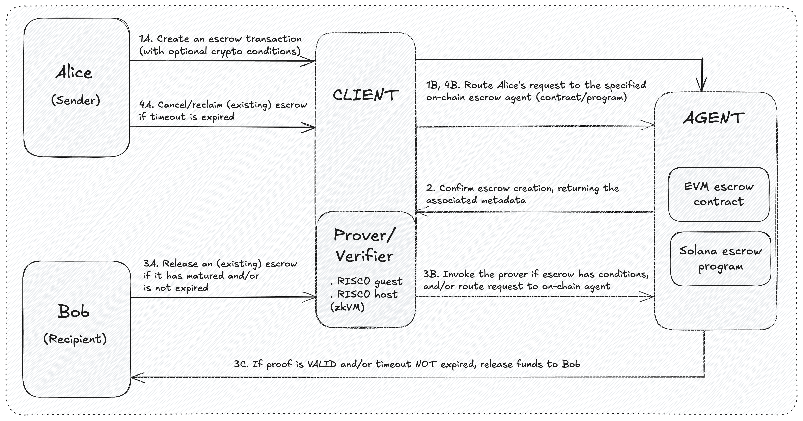
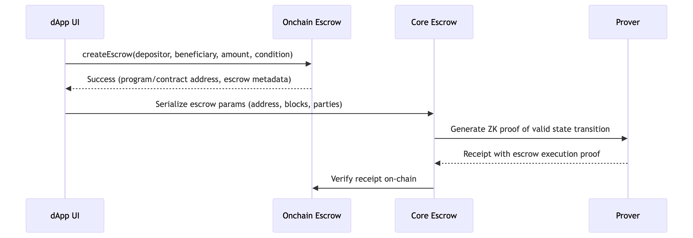

# Zescrow

Zescrow (for zero-knowledge escrow) is a trust-minimized generic implementation of an escrow program.

## Goals

1. **Privacy-Preserving** - Reveal only necessary transaction details to counterparties  
2. **Chain-Agnostic** - Deploy same escrow logic across L1s/L2s via lightweight adapters  
3. **Dispute Minimization** - Cryptographic proof of condition satisfaction preempts 90%+ conflicts  

## Core Features  

- ZK-proof of valid state transitions (initialized → funded → released/disputed)  
- Confidential amounts & participant identities via commitments  
- Chain-agnostic verification via RISC Zero zkVM proofs  
- Solana programs and EVM smart contracts in `/adapters`

## Architecture

1. User initiates an escrow transaction by specifying the asset type, amount, beneficiary, timeout, and release conditions using the dApp interface.
2. Once confirmed, the funds are sent to the escrow component of the on-chain `adapter` (currently a Solana program or an EVM smart contract) where the funds are locked.
3. The transaction metadata are submitted to the `prover` which executes and cryptographically attests to the validity of the escrow release logic. A receipt (i.e., ZK proof) of the computation is generated.
4. The receipt is submitted to the verifier component of the on-chain adapter for verification, using the appropriate RISC0 verifier (e.g., `risc0-ethereum`, `risc0-solana`).

    Zooming in on the proof generation flow, here's the interaction between the `prover` and the on-chain `adapters`:

    

5. If the receipt validates, the specified timeout is not expired, and all other escrow conditions are satisfied, the on-chain escrow adapter releases the funds to the beneficiary, else the funds remain locked until the original depositor withdraws.
6. For a regular timeout expiration, the depositor must also explicitly trigger a withdrawal.

## Contributing

Thank you for considering contributing to this project! All contributions large and small are actively accepted.

- To get started, please read the [contribution guidelines](https://github.com/maatlabs/zescrow/blob/main/CONTRIBUTING.md).

- Browse [Good First Issues](https://github.com/maatlabs/zescrow/labels/good%20first%20issue).

## License

Licensed under [Apache License, Version 2.0](https://github.com/maatlabs/zescrow/blob/main/LICENSE).

Unless you explicitly state otherwise, any contribution intentionally submitted for inclusion in this codebase by you, as defined in the Apache-2.0 license, shall be licensed as above, without any additional terms or conditions.
